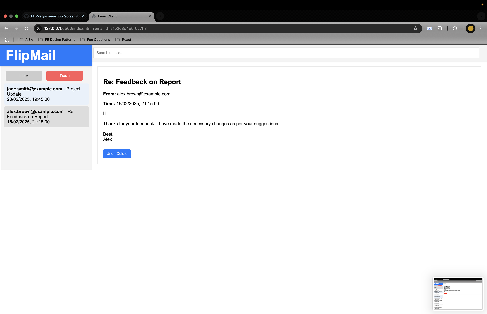
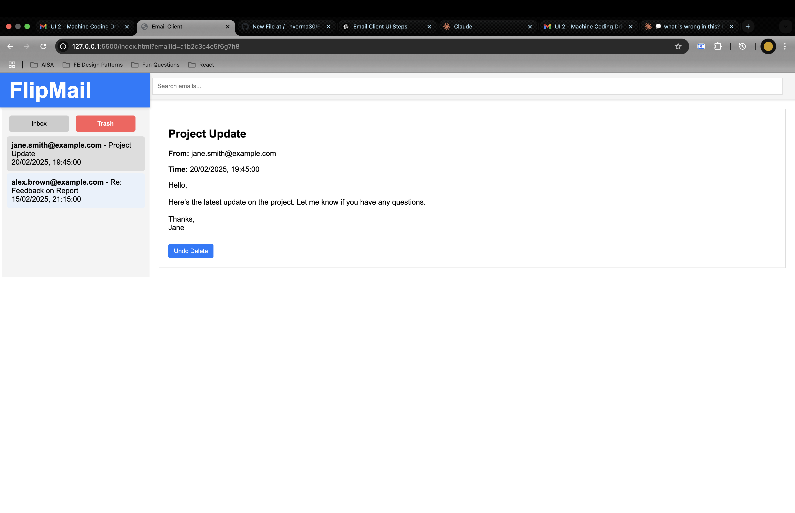
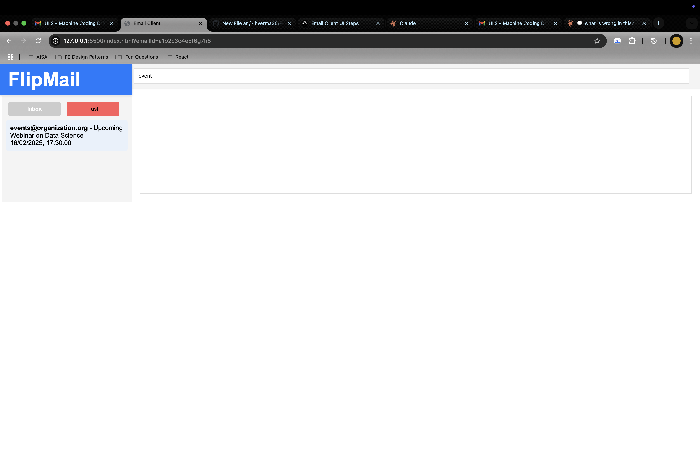

# 📧 FlipMail - A Simple Email Management App

## 🚀 Project Overview
FlipMail is a lightweight and intuitive web-based email management application. It allows users to filter, search, and view emails efficiently while maintaining a clean UI.

## 🎨 Features
✅ Email listing with search functionality  
✅ Unread email highlighting  
✅ Sender name extraction and formatting  
✅ Email preview display  
✅ Responsive and clean UI  

## 🖼️ Screenshots
  
  
 

## 🛠️ Technologies Used
- **Frontend**: HTML, CSS, JavaScript  
- **Backend**: N/A (Client-side only)  
- **Tools**: Git, GitHub  

## 📥 Setup Instructions
1. Clone the repository:  
   ```sh
   git clone https://github.com/your-username/flipmail.git
   cd flipmail
